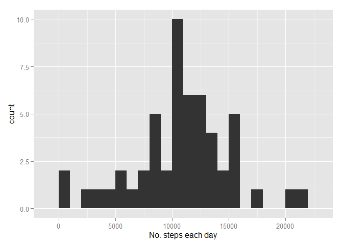
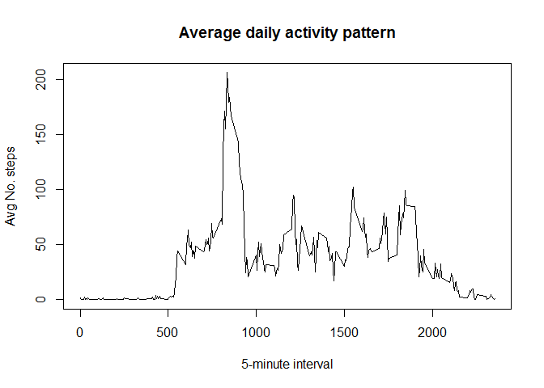
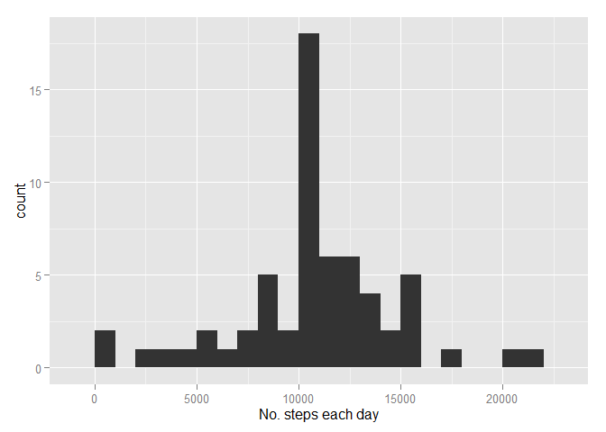
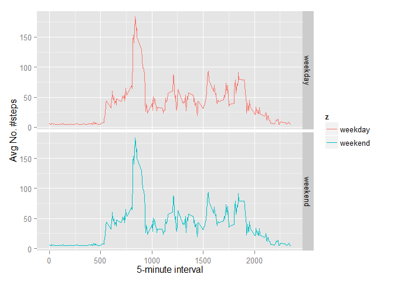

# Reproducible Research: Peer Assessment 1


## Loading and preprocessing the data

```r
unzipfiles <- unzip("activity.zip")
activity <- read.csv(unzipfiles, header = TRUE)
```
Show the head of raw data

```r
head(activity)
```

```
##   steps       date interval
## 1    NA 2012-10-01        0
## 2    NA 2012-10-01        5
## 3    NA 2012-10-01       10
## 4    NA 2012-10-01       15
## 5    NA 2012-10-01       20
## 6    NA 2012-10-01       25
```


## What is mean total number of steps taken per day?
Ignore the missing values in the dataset.

```r
activity.full <- activity[complete.cases(activity),]
```
1. Make a histogram of the total number of steps taken each day

```r
activity.eachday <- aggregate(activity.full$steps, by=list(days=activity.full$date), sum)
names(activity.eachday) <- c("days","stepsum")
library(ggplot2)
ggplot(activity.eachday, aes(x = stepsum)) + geom_histogram(binwidth=1000) + xlab('No. steps each day')
```

 
This is the plot.

2. Calculate and report the mean and median total number of steps taken per day

```r
m1 <- mean(activity.eachday$stepsum)
m2 <- median(activity.eachday$stepsum)
```
The mean and median total number of steps taken per day are 1.0766189\times 10^{4} and 10765 respectively.

## What is the average daily activity pattern?
1. Make a time series plot (i.e. type = "l") of the 5-minute interval (x-axis) and the average number of steps taken, averaged across all days (y-axis)

```r
activity$interval <- as.factor(activity$interval)
temp.fun <- function(x) { mean = mean(x,na.rm=TRUE) }
ts.temp <- by(activity$steps, activity$interval, temp.fun)
plot(as.integer(names(ts.temp)),ts.temp,type="l",xlab="5-minute interval",ylab="Avg No. steps", main="Average daily activity pattern")
```

 

2.Which 5-minute interval, on average across all the days in the dataset, contains the maximum number of steps?

```r
maxname <- as.integer(names(which.max(ts.temp)))
maxvalue <- unname(ts.temp[which.max(ts.temp)])
```
So the maximum 5-minute interval is 835, and the value is 206.1698113.


## Imputing missing values
1. Calculate and report the total number of missing values in the dataset (i.e. the total number of rows with NAs)

```r
NoNA <- nrow(activity) - nrow(activity.full)
```
So the number of NAs in the dataset is 2304.

2. Devise a strategy for filling in all of the missing values in the dataset. The strategy does not need to be sophisticated. For example, you could use the mean/median for that day, or the mean for that 5-minute interval, etc.  

To test:

```r
sum(complete.cases(activity$date)) == nrow(activity)
```

```
## [1] TRUE
```

```r
sum(complete.cases(activity$interval)) == nrow(activity)
```

```
## [1] TRUE
```
Since date and interval variables have no missing values.  
Here is our strategy for filling.   
We impute the missing values of steps as mean of total number of steps taken per day.


```r
activity.mean <- aggregate(activity.full$steps, by=list(days=activity.full$date), mean)
names(activity.mean) <- c("days","stepmean")
activity.new <- activity
activity.new[is.na(activity.new$steps),]$steps <- mean(activity.mean$stepmean)
```
3.Create a new dataset that is equal to the original dataset but with the missing data filled in.  
Since the new dataset activity.new has been created, the first 10 lines of it is:

```r
head(activity.new)
```

```
##     steps       date interval
## 1 37.3826 2012-10-01        0
## 2 37.3826 2012-10-01        5
## 3 37.3826 2012-10-01       10
## 4 37.3826 2012-10-01       15
## 5 37.3826 2012-10-01       20
## 6 37.3826 2012-10-01       25
```
4.The histogram of the total number of steps taken each day is:


```r
activity.new.eachday <- aggregate(activity.new$steps, by=list(days=activity.new$date), sum)
names(activity.new.eachday) <- c("days","stepsum")
library(ggplot2)
ggplot(activity.new.eachday, aes(x = stepsum)) + geom_histogram(binwidth=1000) + xlab('No. steps each day')
```

 


```r
neweachdaymean <- mean(activity.new.eachday$steps)
neweachdaymedian <- median(activity.new.eachday$steps)
```
The mean and median total number of steps taken per day is 1.0766189\times 10^{4} and 1.0766189\times 10^{4} respectively.

We can see that the difference between these values and the estimates from the frist part of the assignment:

```r
missingmean <- mean(activity.eachday$steps) - mean(activity.new.eachday$steps)
missingmedian <- median(activity.eachday$steps) - median(activity.new.eachday$steps)
```
And we can see the differences are 0 and -1.1886792.  
Since we use the mean of total number of steps taken per day for missing value, the difference of mean makes sense.  
The imputing missing data do impact the estimates and estimates change along with the filling strategy.

## Are there differences in activity patterns between weekdays and weekends?
1. Create a new factor variable in the dataset with two levels – “weekday” and “weekend” indicating whether a given date is a weekday or weekend day.

```r
activity.new$cday <- weekdays(as.Date(activity.new$date))
activity.new$Wfactor <- "weekday"
activity.new$Wfactor[activity.new$cday == "Sunday"] <- "weekend"
activity.new$Wfactor[activity.new$cday == "Saturday"] <- "weekend"
activity.new$Wfactor <- as.factor(activity.new$Wfactor)
```
2. Make a panel plot containing a time series plot (i.e. type = "l") of the 5-minute interval (x-axis) and the average number of steps taken, averaged across all weekday days or weekend days (y-axis). 

```r
activity.new$interval <- as.factor(activity.new$interval)
ts.temp <- by(activity.new$steps, activity.new$interval, mean)

tsplot <- data.frame(x=as.integer(names(ts.temp)),y=as.numeric(ts.temp), z = activity.new$Wfactor )
library(ggplot2)
ggplot(tsplot, aes(x = x, y = y, color = z)) + geom_line() + facet_grid(z ~ .) + xlab("5-minute interval")+ylab("Avg No. #steps")
```

 
From the panel plot we can see that the activity patterns of weekdays and weekends are similar.
